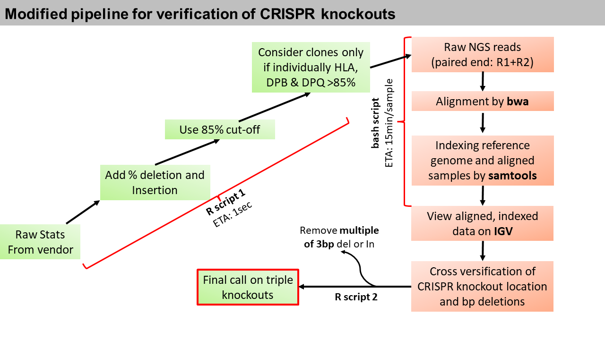
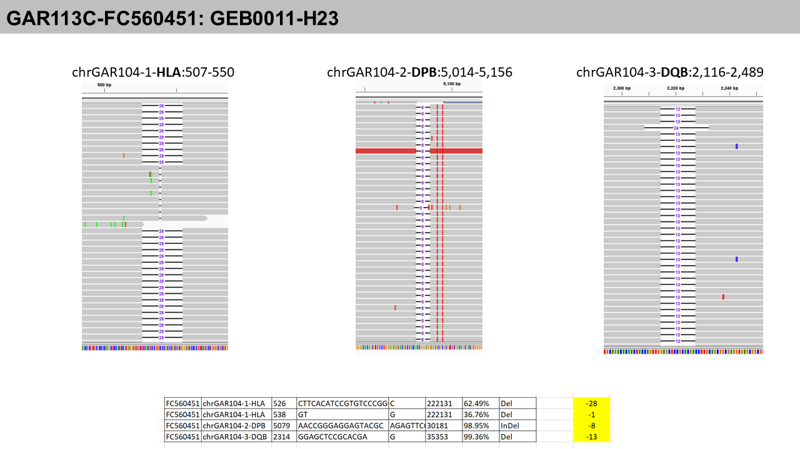

# Genomics_pipeline

## Table of contents    
* [Page 1: 2023-22-07](#id-section1). Chapter 1: CRISPR Knockout validation (Aompicon sequencing) 

* [Page 2: 2023-30-11](#id-section2). Chapter 2: Fastp and bwa of GEB clones


------
<div id='id-section1'/>

## Chapter 1: CRISPR Knockout validation 



### STEP1-R script 1: Add % deletion and Insertion and 85% cut-off

**1. Creating master data from raw files**
```
setwd("C:/Users/aayudh.das/OneDrive - Garuda Therapeutics/master data")
list.files()

data <- read.csv("MASTER data.csv")  
head(data)
id <- read.csv("garuda nd genegoname.csv")
head(id) 

# Merge the data and id datasets based on GeneGo.Name
merged_data <- merge(data, id, by = "GeneGo.Name", all.x = TRUE)

# Keep only the Garuda.Name from the id column
merged_data$Garuda.Name <- merged_data$Garuda.Name.y
merged_data <- merged_data[, !(names(merged_data) %in% c("Garuda.Name.x", "Garuda.Name.y"))]

# Reorder the columns
reordered_data <- merged_data[, c("Batch", "Garuda.Name", "GeneGo.Name", setdiff(names(merged_data), c("Batch", "Garuda.Name", "GeneGo.Name")))]

# Print the first few rows of the reordered dataset
head(reordered_data)

# Calculate the difference in base pairs between Ref and Alt
reordered_data$bp_change <-  nchar(reordered_data$Alt) -nchar(reordered_data$Ref)

# Print the first few rows of the dataset with the new column
head(reordered_data)

write.csv(reordered_data, "Master_data_wBPchnage.csv", row.names = FALSE)
```
**2. 85% cut-off**

```
######85% cut-off--------------------------------------------
HLA <- reordered_data[reordered_data$Chr == "chrGAR104-1-HLA" ,]
DPB <- reordered_data[reordered_data$Chr == "chrGAR104-2-DPB" ,]
DQB <- reordered_data[reordered_data$Chr == "chrGAR104-3-DQB" ,]

head(HLA)


# Load the required library
library(dplyr)

# Assuming your reordered_data frame is named 'HLA'
HLA_with_sum <- HLA %>%
  group_by(GeneGo.Name) %>%
  mutate(Sum_frequency = sum(as.numeric(gsub("[%]", "", Frequency)))) %>%
  ungroup()

# View the updated reordered_data frame
head(HLA_with_sum)

# Assuming your reordered_data frame is named 'DPB'
DPB_with_sum <- DPB %>%
  group_by(GeneGo.Name) %>%
  mutate(Sum_frequency = sum(as.numeric(gsub("[%]", "", Frequency)))) %>%
  ungroup()

# View the updated reordered_data frame
head(DPB_with_sum)


# Assuming your reordered_data frame is named 'DQB'
DQB_with_sum <- DQB %>%
  group_by(GeneGo.Name) %>%
  mutate(Sum_frequency = sum(as.numeric(gsub("[%]", "", Frequency)))) %>%
  ungroup()

# View the updated reordered_data frame
head(DQB_with_sum)

reordered_data_summed_freq <- rbind (HLA_with_sum,DPB_with_sum,DQB_with_sum)
head(reordered_data_summed_freq)

# Load the required library
library(dplyr)

# Assuming your reordered_data frame is named 'HLA'
reordered_data_summed_freq_filtered <- reordered_data_summed_freq %>%
  group_by(GeneGo.Name) %>%
  ungroup() %>%
  filter(Sum_frequency >= 85)%>%
  arrange(GeneGo.Name) 

required_types <- c("chrGAR104-1-HLA", "chrGAR104-2-DPB", "chrGAR104-3-DQB")

# Filter the reordered_data to keep only required GeneGo.Name values
filtered_reordered_data <- reordered_data_summed_freq_filtered %>%
  group_by(GeneGo.Name) %>%
  filter(all(required_types %in% Chr)) %>%
  distinct()

write.csv(filtered_reordered_data, "Master_data_wBPchnage_85%cutoff.csv", row.names = FALSE)
```

**3. Subset a batch**
```
###----------------SUBSET a BATCH----------------------

setwd("C:/Users/aayudh.das/OneDrive - Garuda Therapeutics/master data")
list.files()
df <- read.csv("Master_data_wBPchnage_85%cutoff.csv")
head(df)

# Assuming your DataFrame is named 'df'
subset_df <- df[df$Batch %in% c("GAR113H", "GAR111J"), ]
library(openxlsx)
#write.xlsx(subset_df, "GAR113H_GAR111J_85cutoff_detailed.xlsx", rowNames = FALSE)


#####-------------count samples--
# Assuming your DataFrame is named 'df'
unique_gene_count <- length(unique(subset_df$GeneGo.Name))
print(unique_gene_count)

# Create a new dataset with the unique gene count and a column named 'GeneGo.Name_85cutoff'
new_data <- subset_df[,1:3]
library(data.table)
samples <- unique(setDT(new_data)[order(GeneGo.Name, -GeneGo.Name)], by = "GeneGo.Name")

write.xlsx(samples, "GAR113H_GAR111J_85cutoff_clones_name.xlsx", rowNames = FALSE)
```
### STEP2- Bash script 1: Doing alignment and indexing (bwa and samtools)

Get the ref file (.fa) 

```
#!/bin/bash


cd /data/home/aayudh-das/NGS_CRISPR_validation/GAR113H/FC640335_S11

cp /data/home/aayudh-das/NGS_CRISPR_validation/GAR104.fa /data/home/aayudh-das/NGS_CRISPR_validation/GAR113H/FC640335_S11

bwa index GAR104.fa

bwa mem GAR104.fa FC640335_S11_R1_001.fastq.gz FC640335_S11_R2_001.fastq.gz> output.sam

samtools view -bS output.sam > output.bam

samtools sort output.bam -o sorted_output.bam

samtools index sorted_output.bam

samtools sort -o FC640335_S11.bam sorted_output.bam

samtools index FC640335_S11.bam
```

### STEP3- Check in IGV to confirm the bp chnge



### STEP4- R script 2- Exclude multiple of 3
if the deletion or insertion is a multiple of three base pairs, it avoids frameshift mutations. A frameshift mutation occurs when the number of inserted or deleted nucleotides is not divisible by three, causing a shift in the reading frame of the gene. This results in a completely different sequence of codons downstream from the mutation site. As a result, the ribosome, which reads the mRNA sequence to assemble the protein, will interpret the sequence in the incorrect frame, leading to the synthesis of a nonfunctional or entirely different protein.

```
setwd("C:/Users/aayudh.das/OneDrive - Garuda Therapeutics/master data")
list.files()
##After confirming from IGV
###remove multiple of 3
library(readxl)

data <- read_excel("GAR113H_GAR111J_85cutoff_detailed.xlsx")
head(data)

# Remove rows where "bp_change" is a multiple of 3
data_filtered <- data[data$bp_change %% 3 != 0, ]

# Load the required library
library(dplyr)
# Now, data_filtered contains the rows where "bp_change" is not a multiple of 3
required_types <- c("chrGAR104-1-HLA", "chrGAR104-2-DPB", "chrGAR104-3-DQB")

# Filter the reordered_data to keep only required GeneGo.Name values
filtered_reordered_data <- data_filtered %>%
  group_by(GeneGo.Name) %>%
  filter(all(required_types %in% Chr)) %>%
  distinct()

#####-------------count samples--
# Assuming your DataFrame is named 'df'
unique_gene_count <- length(unique(filtered_reordered_data$GeneGo.Name))
print(unique_gene_count)

# Create a new dataset with the unique gene count and a column named 'GeneGo.Name_85cutoff'
# Select the first three columns and the last column
new_data <- filtered_reordered_data[, c(1:3, ncol(filtered_reordered_data))]
library(data.table)
samples <- unique(setDT(new_data)[order(GeneGo.Name, -GeneGo.Name)], by = "GeneGo.Name")

library(openxlsx)
write.xlsx(samples, "1.GAR113H_GAR111J_FINAL_clones_name.xlsx", rowNames = FALSE)
```

-----
<div id='id-section2'/>


## Chapter 2: Fastp and bwa of GEB clones

### A) fastp
fastp is a bioinformatics tool designed for the preprocessing and quality control of high-throughput sequencing data, particularly for Illumina sequencing platforms. It is an efficient and versatile tool that performs a variety of tasks, including adapter removal, quality filtering, and trimming of low-quality bases. The primary goal of fastp is to enhance the quality of raw sequencing data before downstream analysis, such as genome assembly, variant calling, or other bioinformatics applications.

```
/data/home/aayudh-das/fastp
-w 96                       # Use 96 CPU threads for parallel processing
--detect_adapter_for_pe     # Automatically detect and remove adapters for paired-end data
-W 4                        # Set the window size option shared by cut_front, cut_tail, or cut_sliding to 4
-M 20                       # Set the mean quality requirement option shared by cut_front, cut_tail, or cut_sliding to 20
--cut_by_quality3           # Trim low-quality bases from the 3' end of the read
--length_required 15        # Discard reads shorter than 15 bases
-i /data/home/aayudh-das/sop_test/GEB_0015_43A.R1.fastq.gz  # Input file for the first read pair
-o /data/home/aayudh-das/sop_test/GEB_0015_43A.R1.trimmed.fastq.gz  # Output file for the trimmed first read pair
-I /data/home/aayudh-das/sop_test/GEB_0015_43A.R2.fastq.gz  # Input file for the second read pair
-O /data/home/aayudh-das/sop_test/GEB_0015_43A.R2.trimmed.fastq.gz  # Output file for the trimmed second read pair
```
Explanation of options:

-w 96: This specifies the number of CPU threads to be used for parallel processing. Adjust this based on the available resources.
--detect_adapter_for_pe: Enables automatic detection and removal of adapters for paired-end data.
-W 4: Sets the window size option for quality control operations like cut_front, cut_tail, or cut_sliding to 4.
-M 20: Sets the mean quality requirement for quality control operations to 20.
--cut_by_quality3: Trims low-quality bases from the 3' end of the reads.
--length_required 15: Discards reads that are shorter than 15 bases.
-i and -I: Specify the input files for the first and second read pairs, respectively.
-o and -O: Specify the output files for the trimmed first and second read pairs, respectively.
The provided command is tailored for processing paired-end sequencing data (-i and -I options). It's essential to adjust parameters based on the specific characteristics of your sequencing data and quality requirements.

### B) bwa

BWA (Burrows-Wheeler Aligner) is a widely used bioinformatics tool for mapping DNA sequences against a large reference genome. It is particularly popular for its speed and accuracy in aligning short DNA sequences generated by high-throughput sequencing technologies like Illumina. Below is an overview of BWA and its main features:

Before doing the samples you need to index the hg19.fa
```
gzip -dc hg19.fa.gz > hg19.fa
sudo bwa index hg19.fa
```
Now do a sample
```
bwa mem -A 1 -B 4 -O 6,6 -E 1,1 -L 5,5 -U 17 hg19.fa GEB_0015_43A.R1.trimmed.fastq.gz GEB_0015_43A.R2.trimmed.fastq.gz> output.sam
samtools view -bS output.sam > output.bam
samtools sort output.bam -o sorted_output.bam
samtools index sorted_output.bam
samtools sort -o GEB_0015_43A.bam sorted_output.bam
samtools index GEB_0015_43A.bam
```
Explanation of options:
bwa mem
-R <attach read group information from sample metadata>
-A 1 # matching score
-B 4 # mismatch penalty
-O 6,6 # gap open penalty
-E 1,1 # gap extension penalty
-L 5,5 # clipping penalty
-U 17 # unpaired penalty

### C) dedup

```
sambamba markdup -t 72 -r --overflow-list-size=10000000 GEB_0015_43A.bam GEB_0015_43A.hg19.dedup.bam
```

This command is a part of bioinformatics data analysis, specifically for processing BAM files, which are binary versions of Sequence Alignment/Map (SAM) files. These files contain information about the alignment of sequencing reads to reference genomes. The command you've provided uses sambamba markdup, a tool for marking duplicates in BAM files. Here's a breakdown of the command:

sambamba markdup: This is the command to invoke the Sambamba tool for marking duplicates. Sambamba is known for its efficiency in handling large genomic datasets.

-t 72: This option specifies the number of threads to be used for processing. In this case, it's set to 72, which means the command will try to use 72 CPU threads. This is useful for parallel processing and can significantly speed up the computation on systems with multiple cores.

-r: This flag tells Sambamba to remove duplicates. Instead of just marking them, it will actually delete the duplicate reads from the output file.

--overflow-list-size=10000000: This option sets the size of the overflow list. In the context of duplicate marking, an overflow list is used when in-memory data structures are insufficient to store all the necessary information. A larger list size can handle more reads but requires more memory.

GEB_0015_43A.bam: This is the input BAM file. It's the file you are processing to find and mark or remove duplicates.

GEB_0015_43A.hg19.dedup.bam: This is the output BAM file. It will contain the same data as the input file but with duplicates marked or removed, as specified.
