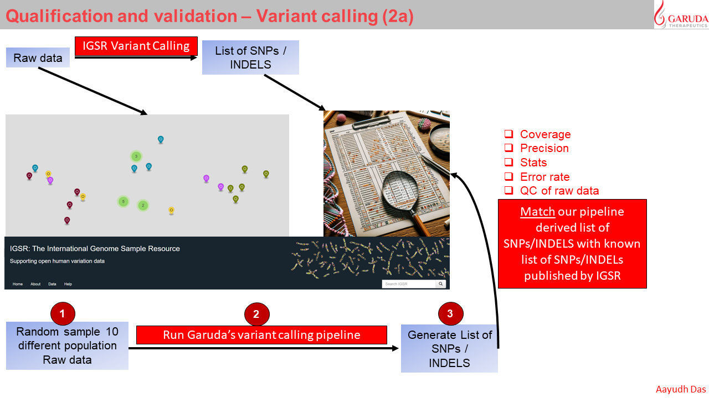
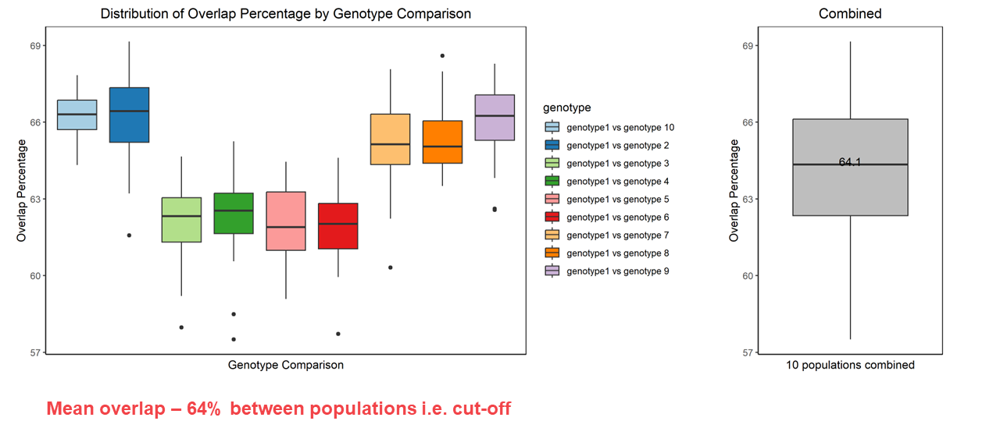

# Computational Biology & Genomics pipelines by Aayudh

## Table of contents    
* [Page 1: 2023-22-07](#id-section1). Chapter 1: CRISPR Knockout validation (Amplicon sequencing) 

* [Page 2: 2023-30-11](#id-section2). Chapter 2: WGS variant calling pipeline (Fastp, bwa & strelka2)

* [Page 3: 2024-30-03](#id-section3). Chapter 3: WGS annnotations with databases (SnpSift and snpEff)

* [Page 4: 2024-30-03](#id-section4). Chapter 4: Clinvar and MissionBio incorporation

* [Page 4: 2024-30-03](#id-section5). Chapter 5: COSMIC, DEPMAP, ONCO-PANEL incorporation

* [Page 5: 2024-30-03](#id-section6). Chapter 6: Visualization of Results

* [Page 6: 2024-15-01](#id-section7). Chapter 7: WGS variant calling qualification

* [Page 7: 2024-20-02](#id-section8). Chapter 8: WGS variant calling- pre-qualification criteria

------
<div id='id-section1'/>

## Chapter 1: CRISPR Knockout validation 


### STEP1-R script 1: Add % deletion and Insertion and 85% cut-off

**1. Creating master data from raw files**
```
setwd("C:/Users/aayudh.das/OneDrive - Garuda Therapeutics/master data")
list.files()

data <- read.csv("MASTER data.csv")  
head(data)
id <- read.csv("garuda nd genegoname.csv")
head(id) 

# Merge the data and id datasets based on GeneGo.Name
merged_data <- merge(data, id, by = "GeneGo.Name", all.x = TRUE)

# Keep only the Garuda.Name from the id column
merged_data$Garuda.Name <- merged_data$Garuda.Name.y
merged_data <- merged_data[, !(names(merged_data) %in% c("Garuda.Name.x", "Garuda.Name.y"))]

# Reorder the columns
reordered_data <- merged_data[, c("Batch", "Garuda.Name", "GeneGo.Name", setdiff(names(merged_data), c("Batch", "Garuda.Name", "GeneGo.Name")))]

# Print the first few rows of the reordered dataset
head(reordered_data)

# Calculate the difference in base pairs between Ref and Alt
reordered_data$bp_change <-  nchar(reordered_data$Alt) -nchar(reordered_data$Ref)

# Print the first few rows of the dataset with the new column
head(reordered_data)

write.csv(reordered_data, "Master_data_wBPchnage.csv", row.names = FALSE)
```
**2. 85% cut-off**

```
######85% cut-off--------------------------------------------
HLA <- reordered_data[reordered_data$Chr == "chrGAR104-1-HLA" ,]
DPB <- reordered_data[reordered_data$Chr == "chrGAR104-2-DPB" ,]
DQB <- reordered_data[reordered_data$Chr == "chrGAR104-3-DQB" ,]

head(HLA)


# Load the required library
library(dplyr)

# Assuming your reordered_data frame is named 'HLA'
HLA_with_sum <- HLA %>%
  group_by(GeneGo.Name) %>%
  mutate(Sum_frequency = sum(as.numeric(gsub("[%]", "", Frequency)))) %>%
  ungroup()

# View the updated reordered_data frame
head(HLA_with_sum)

# Assuming your reordered_data frame is named 'DPB'
DPB_with_sum <- DPB %>%
  group_by(GeneGo.Name) %>%
  mutate(Sum_frequency = sum(as.numeric(gsub("[%]", "", Frequency)))) %>%
  ungroup()

# View the updated reordered_data frame
head(DPB_with_sum)


# Assuming your reordered_data frame is named 'DQB'
DQB_with_sum <- DQB %>%
  group_by(GeneGo.Name) %>%
  mutate(Sum_frequency = sum(as.numeric(gsub("[%]", "", Frequency)))) %>%
  ungroup()

# View the updated reordered_data frame
head(DQB_with_sum)

reordered_data_summed_freq <- rbind (HLA_with_sum,DPB_with_sum,DQB_with_sum)
head(reordered_data_summed_freq)

# Load the required library
library(dplyr)

# Assuming your reordered_data frame is named 'HLA'
reordered_data_summed_freq_filtered <- reordered_data_summed_freq %>%
  group_by(GeneGo.Name) %>%
  ungroup() %>%
  filter(Sum_frequency >= 85)%>%
  arrange(GeneGo.Name) 

required_types <- c("chrGAR104-1-HLA", "chrGAR104-2-DPB", "chrGAR104-3-DQB")

# Filter the reordered_data to keep only required GeneGo.Name values
filtered_reordered_data <- reordered_data_summed_freq_filtered %>%
  group_by(GeneGo.Name) %>%
  filter(all(required_types %in% Chr)) %>%
  distinct()

write.csv(filtered_reordered_data, "Master_data_wBPchnage_85%cutoff.csv", row.names = FALSE)
```

**3. Subset a batch**
```
###----------------SUBSET a BATCH----------------------

setwd("C:/Users/aayudh.das/OneDrive - Garuda Therapeutics/master data")
list.files()
df <- read.csv("Master_data_wBPchnage_85%cutoff.csv")
head(df)

# Assuming your DataFrame is named 'df'
subset_df <- df[df$Batch %in% c("GAR113H", "GAR111J"), ]
library(openxlsx)
#write.xlsx(subset_df, "GAR113H_GAR111J_85cutoff_detailed.xlsx", rowNames = FALSE)


#####-------------count samples--
# Assuming your DataFrame is named 'df'
unique_gene_count <- length(unique(subset_df$GeneGo.Name))
print(unique_gene_count)

# Create a new dataset with the unique gene count and a column named 'GeneGo.Name_85cutoff'
new_data <- subset_df[,1:3]
library(data.table)
samples <- unique(setDT(new_data)[order(GeneGo.Name, -GeneGo.Name)], by = "GeneGo.Name")

write.xlsx(samples, "GAR113H_GAR111J_85cutoff_clones_name.xlsx", rowNames = FALSE)
```
### STEP2- Bash script 1: Doing alignment and indexing (bwa and samtools)

Get the ref file (.fa) 

```
#!/bin/bash


cd /data/home/aayudh-das/NGS_CRISPR_validation/GAR113H/FC640335_S11

cp /data/home/aayudh-das/NGS_CRISPR_validation/GAR104.fa /data/home/aayudh-das/NGS_CRISPR_validation/GAR113H/FC640335_S11

bwa index GAR104.fa

bwa mem GAR104.fa FC640335_S11_R1_001.fastq.gz FC640335_S11_R2_001.fastq.gz> output.sam

samtools view -bS output.sam > output.bam

samtools sort output.bam -o sorted_output.bam

samtools index sorted_output.bam

samtools sort -o FC640335_S11.bam sorted_output.bam

samtools index FC640335_S11.bam
```

### STEP3- Check in IGV to confirm the bp chnge


### STEP4- R script 2- Exclude multiple of 3
if the deletion or insertion is a multiple of three base pairs, it avoids frameshift mutations. A frameshift mutation occurs when the number of inserted or deleted nucleotides is not divisible by three, causing a shift in the reading frame of the gene. This results in a completely different sequence of codons downstream from the mutation site. As a result, the ribosome, which reads the mRNA sequence to assemble the protein, will interpret the sequence in the incorrect frame, leading to the synthesis of a nonfunctional or entirely different protein.

```
setwd("C:/Users/aayudh.das/OneDrive - Garuda Therapeutics/master data")
list.files()
##After confirming from IGV
###remove multiple of 3
library(readxl)

data <- read_excel("GAR113H_GAR111J_85cutoff_detailed.xlsx")
head(data)

# Remove rows where "bp_change" is a multiple of 3
data_filtered <- data[data$bp_change %% 3 != 0, ]

# Load the required library
library(dplyr)
# Now, data_filtered contains the rows where "bp_change" is not a multiple of 3
required_types <- c("chrGAR104-1-HLA", "chrGAR104-2-DPB", "chrGAR104-3-DQB")

# Filter the reordered_data to keep only required GeneGo.Name values
filtered_reordered_data <- data_filtered %>%
  group_by(GeneGo.Name) %>%
  filter(all(required_types %in% Chr)) %>%
  distinct()

#####-------------count samples--
# Assuming your DataFrame is named 'df'
unique_gene_count <- length(unique(filtered_reordered_data$GeneGo.Name))
print(unique_gene_count)

# Create a new dataset with the unique gene count and a column named 'GeneGo.Name_85cutoff'
# Select the first three columns and the last column
new_data <- filtered_reordered_data[, c(1:3, ncol(filtered_reordered_data))]
library(data.table)
samples <- unique(setDT(new_data)[order(GeneGo.Name, -GeneGo.Name)], by = "GeneGo.Name")

library(openxlsx)
write.xlsx(samples, "1.GAR113H_GAR111J_FINAL_clones_name.xlsx", rowNames = FALSE)
```

-----
<div id='id-section2'/>


## Chapter 2: WGS variant calling pipeline

### A) fastp
fastp is a bioinformatics tool designed for the preprocessing and quality control of high-throughput sequencing data, particularly for Illumina sequencing platforms. It is an efficient and versatile tool that performs a variety of tasks, including adapter removal, quality filtering, and trimming of low-quality bases. The primary goal of fastp is to enhance the quality of raw sequencing data before downstream analysis, such as genome assembly, variant calling, or other bioinformatics applications.

```
/data/home/aayudh-das/fastp
-w 96                       # Use 96 CPU threads for parallel processing
--detect_adapter_for_pe     # Automatically detect and remove adapters for paired-end data
-W 4                        # Set the window size option shared by cut_front, cut_tail, or cut_sliding to 4
-M 20                       # Set the mean quality requirement option shared by cut_front, cut_tail, or cut_sliding to 20
--cut_by_quality3           # Trim low-quality bases from the 3' end of the read
--length_required 15        # Discard reads shorter than 15 bases
-i /data/home/aayudh-das/sop_test/GEB_0015_43A.R1.fastq.gz  # Input file for the first read pair
-o /data/home/aayudh-das/sop_test/GEB_0015_43A.R1.trimmed.fastq.gz  # Output file for the trimmed first read pair
-I /data/home/aayudh-das/sop_test/GEB_0015_43A.R2.fastq.gz  # Input file for the second read pair
-O /data/home/aayudh-das/sop_test/GEB_0015_43A.R2.trimmed.fastq.gz  # Output file for the trimmed second read pair
```
Explanation of options:

-w 96: This specifies the number of CPU threads to be used for parallel processing. Adjust this based on the available resources.
--detect_adapter_for_pe: Enables automatic detection and removal of adapters for paired-end data.
-W 4: Sets the window size option for quality control operations like cut_front, cut_tail, or cut_sliding to 4.
-M 20: Sets the mean quality requirement for quality control operations to 20.
--cut_by_quality3: Trims low-quality bases from the 3' end of the reads.
--length_required 15: Discards reads that are shorter than 15 bases.
-i and -I: Specify the input files for the first and second read pairs, respectively.
-o and -O: Specify the output files for the trimmed first and second read pairs, respectively.
The provided command is tailored for processing paired-end sequencing data (-i and -I options). It's essential to adjust parameters based on the specific characteristics of your sequencing data and quality requirements.

### B) bwa

BWA (Burrows-Wheeler Aligner) is a widely used bioinformatics tool for mapping DNA sequences against a large reference genome. It is particularly popular for its speed and accuracy in aligning short DNA sequences generated by high-throughput sequencing technologies like Illumina. Below is an overview of BWA and its main features:

Before doing the samples you need to index the hg19.fa
```
gzip -dc hg19.fa.gz > hg19.fa
sudo bwa index hg19.fa
```
Now do a sample
```
bwa mem -A 1 -B 4 -O 6,6 -E 1,1 -L 5,5 -U 17 hg19.fa GEB_0015_43A.R1.trimmed.fastq.gz GEB_0015_43A.R2.trimmed.fastq.gz> output.sam
samtools view -bS output.sam > output.bam
samtools sort output.bam -o sorted_output.bam
samtools index sorted_output.bam
samtools sort -o GEB_0015_43A.bam sorted_output.bam
samtools index GEB_0015_43A.bam
```
Explanation of options:
bwa mem
-R <attach read group information from sample metadata>
-A 1 # matching score
-B 4 # mismatch penalty
-O 6,6 # gap open penalty
-E 1,1 # gap extension penalty
-L 5,5 # clipping penalty
-U 17 # unpaired penalty

### C) dedup

```
sambamba markdup -t 72 -r --overflow-list-size=10000000 GEB_0015_43A.bam GEB_0015_43A.hg19.dedup.bam

sambamba markdup -t 72 -r --overflow-list-size=10000000 ICB0004_02CP11.bam ICB0004_02CP11.bam.hg19.dedup.bam
```

This command is a part of bioinformatics data analysis, specifically for processing BAM files, which are binary versions of Sequence Alignment/Map (SAM) files. These files contain information about the alignment of sequencing reads to reference genomes. The command you've provided uses sambamba markdup, a tool for marking duplicates in BAM files. Here's a breakdown of the command:

sambamba markdup: This is the command to invoke the Sambamba tool for marking duplicates. Sambamba is known for its efficiency in handling large genomic datasets.

-t 72: This option specifies the number of threads to be used for processing. In this case, it's set to 72, which means the command will try to use 72 CPU threads. This is useful for parallel processing and can significantly speed up the computation on systems with multiple cores.

-r: This flag tells Sambamba to remove duplicates. Instead of just marking them, it will actually delete the duplicate reads from the output file.

--overflow-list-size=10000000: This option sets the size of the overflow list. In the context of duplicate marking, an overflow list is used when in-memory data structures are insufficient to store all the necessary information. A larger list size can handle more reads but requires more memory.

GEB_0015_43A.bam: This is the input BAM file. It's the file you are processing to find and mark or remove duplicates.

GEB_0015_43A.hg19.dedup.bam: This is the output BAM file. It will contain the same data as the input file but with duplicates marked or removed, as specified.

### D) strelka2

Get a docker where you can run the strelka2. Remember that hg19.fa file needs to be indexed using samtools fdaix hg19.fa.

```
docker pull dceoy/strelka:latest

docker image ls

docker run --rm -v `pwd`:/work -w /work --entrypoint configureStrelkaSomaticWorkflow.py dceoy/strelka:latest --tumorBam GEB_0015_43A.hg19.dedup.bam --normalBam ICB0004_02CP11.bam.hg19.dedup.bam --referenceFasta hg19.fa --runDir /work

docker run --rm -v `pwd`:/work -w /work --entrypoint ./runWorkflow.py dceoy/strelka:latest -m local -j 32
```

to kill the job---

```
docker container rm -f 98b136db5ae0
```


**navigate strelka2 results**

```
root@ip-10-180-11-166:/data/home/aayudh-das/sop_test/results/variants# ll
total 30708
drwxr-xr-x 2 root root     4096 Mar  5 19:27 ./
drwxr-xr-x 4 root root     4096 Mar  5 18:51 ../
-rw-r--r-- 1 root root  5225243 Mar  5 19:27 somatic.indels.vcf.gz
-rw-r--r-- 1 root root   703508 Mar  5 19:27 somatic.indels.vcf.gz.tbi
-rw-r--r-- 1 root root 24001021 Mar  5 19:27 somatic.snvs.vcf.gz
-rw-r--r-- 1 root root  1501690 Mar  5 19:27 somatic.snvs.vcf.gz.tbi
root@ip-10-180-11-166:/data/home/aayudh-das/sop_test/results/variants#
```
-----
<div id='id-section3'/>


## Chapter 3:  WGS annnotations with databases (SnpSift and snpEff)

Download databases- 

**1. dbSNP** - ftp://ftp.ncbi.nlm.nih.gov/snp/organisms/human_9606_b150_GRCh37p13/VCF/GATK/common_all_20170710.vcf.gz

**2. gnomad_exomes**- https://hgdownload.soe.ucsc.edu/gbdb/hg19/gnomAD/vcf/

other libraries are - **3. gnomad_genomes** , **4. esp6500**, **5. clinvar**, **6. cosmic91**

**YOU NEED TO INDEX EVERY DATABASE FILE**

```
tabix gnomad.genomes.r2.0.2.sites.w_AF.vcf.gz
```

### SnpSift & snpEff

snpEff: A tool used for annotating variants in VCF files and predicting their effects on genes (e.g., nonsynonymous coding changes, synonymous changes). It uses a database of genomic information to interpret the variants found in a VCF file based on the reference genome specified.

```
#!/bin/bash

# snpSift step run on both Strelka2 SNV and INDEL output VCFs ###################
 # snpEff step run on both Strelka2 SNV and INDEL outputs ##########################
bgzip -dc GEB_0015_43A_vs_ICB0004_02CP11_SNPs.vcf.gz |
        java -Xmx8g -jar /data/home/aayudh-das/snpEff/SnpSift.jar annotate -name dbsnp_ dbSNP.vcf.gz - |
        java -Xmx8g -jar /data/home/aayudh-das/snpEff/SnpSift.jar annotate -name gnomad_exomes_ gnomad.exomes.r2.0.2.sites.vcf.gz - |
        java -Xmx8g -jar /data/home/aayudh-das/snpEff/SnpSift.jar annotate -name gnomad_genomes_ gnomad.genomes.r2.0.2.sites.w_AF.vcf.gz - |
        awk '{gsub(/\chr/, "")}1' |
        java -Xmx8g -jar /data/home/aayudh-das/snpEff/SnpSift.jar annotate -name esp6500_ ESP6500SI-V2-SSA137.GRCh38-liftover.snps_indels_fix.vcf.gz - |
        java -Xmx8g -jar /data/home/aayudh-das/snpEff/SnpSift.jar annotate -name clinVar_ clinvar_20230604.vcf.gz - |
        java -Xmx8g -jar /data/home/aayudh-das/snpEff/SnpSift.jar annotate -name COSMIC_ cosmic91_hg19.vcf.gz - |
        bgzip -c > GEB_0015_43A_SNPs.vcf.gz
        java -Xmx8g -jar /data/home/aayudh-das/snpEff/snpEff.jar hg19 GEB_0015_43A_SNPs.vcf.gz |
        bgzip -c > GEB_0015_43A_snpEff_SNPs.vcf.gz

        rm GEB_0015_43A_SNPs.vcf.gz

```

**1.** bgzip -dc GEB_0015_43A_vs_ICB0004_02CP11_SNPs.vcf.gz |: This command decompresses the gzipped VCF file (GEB_0015_43A_vs_ICB0004_02CP11_SNPs.vcf.gz) that contains SNP variant calls. bgzip is part of the htslib package, and -dc flags decompress the file to standard output (stdout), piping (|) the output to the next command without creating a temporary file.

**2.** java -Xmx8g -jar /data/home/aayudh-das/snpEff/SnpSift.jar annotate -name dbsnp_ dbSNP.vcf.gz - |: The decompressed VCF data is piped into SnpSift's annotate command, which adds annotation information from the dbSNP database (dbSNP.vcf.gz). The -Xmx8g option specifies that Java can use up to 8 gigabytes of memory for the process, ensuring enough resources are available. The -name dbsnp_ option prefixes the annotation names with "dbsnp_" in the output file.

**3.** Following the first annotation, two more annotations are applied in a similar manner: one from the gnomAD exomes dataset (gnomad.exomes.r2.0.2.sites.vcf.gz) and one from the gnomAD genomes dataset (gnomad.genomes.r2.0.2.sites.w_AF.vcf.gz). These datasets provide allele frequency information among other metrics from a large number of sequenced exomes and genomes, respectively. The annotations are prefixed with gnomad_exomes_ and gnomad_genomes_ in the output.

**4.** bgzip -c > testdbsnp_gnomadExomes_genomes_SNPs.vcf.gz: The annotated VCF stream is then compressed using bgzip with the -c option to write the output to stdout, which is redirected to a new gzipped file named testdbsnp_gnomadExomes_genomes_SNPs.vcf.gz. This file now contains the original SNP data with added annotations from dbSNP, gnomAD exomes, and gnomAD genomes.

**5.** java -Xmx8g -jar /data/home/aayudh-das/snpEff/snpEff.jar hg19 testdbsnp_gnomadExomes_genomes_SNPs.vcf.gz |: This command runs SnpEff, which is a genetic variant annotation and effect prediction tool. It uses the previously annotated and gzipped VCF file as input, and hg19 refers to the human genome build 19, which is used as the reference for annotation. SnpEff predicts the effects these SNPs have on genes, such as nonsynonymous changes, synonymous changes, stop gains/losses, etc.

**6.** bgzip -c > testdbsnp_gnomadExomes_genomes_snpEff_SNPs.vcf.gz: Finally, the output from SnpEff, which includes both the original annotations and the new effect predictions, is compressed back into a gzipped VCF file named testdbsnp_gnomadExomes_genomes_snpEff_SNPs.vcf.gz.

**view output vcf.gz**

```
zcat testdbsnp_gnomadExomes_genomes_SNPs.vcf.gz | head -n 475
```
**better code**
```
zcat testdbsnp_gnomadExomes_genomes_SNPs.vcf.gz | grep -Ev '^##' | less
```

### Split bi-allelic 

The goal of the provided commands is to normalize genetic variant data from VCF files containing SNPs and INDELs to ensure that all variants are represented in a standardized, bi-allelic form. This normalization process involves splitting multi-allelic variant entries into separate bi-allelic entries, making the data easier to analyze and interpret. The normalized data is then saved into new, separate VCF files for SNPs and INDELs, facilitating subsequent genetic analyses and comparisons.

```
#!/bin/bash

cat GEB_0015_43A_snpEff_SNPs.vcf.gz | bcftools norm -m -any -o bi_allelics_GEB_0015_43A_SNPs.vcf.gz
cat GEB_0015_43A_snpeff_INDELs.vcf.gz | bcftools norm -m -any -o bi_allelics_GEB_0015_43A-INDELs.vcf.gz
```
cat GEB_0015_43A_snpEff_SNPs.vcf.gz: This command uses cat to read the contents of a gzipped (compressed) VCF file containing SNP variants that have been annotated by snpEff (a genetic variant annotation and effect prediction tool).
| bcftools norm -m -any -o bi_allelics_GEB_0015_43A_SNPs.vcf.gz: The output from cat is piped (|) into bcftools norm, which is a command from the bcftools suite, a set of utilities for variant calling and manipulating VCF/BCF files. The norm command is used here to normalize the variants, with the -m -any options specifying that multi-allelic variants should be split into multiple bi-allelic entries. The -o option specifies the output file name for the resulting bi-allelic SNP variants.
Processing INDELs:

cat GEB_0015_43A_snpeff_INDELs.vcf.gz: Similar to the first command, this reads a gzipped VCF file, but this time the file contains INDEL variants annotated by snpEff.
| bcftools norm -m -any -o bi_allelics_GEB_0015_43A-INDELs.vcf.gz: Again, the output is piped into bcftools norm for normalization. The same options are used to split multi-allelic INDELs into bi-allelic entries, and the output is saved to a specified file for bi-allelic INDEL variants.

### Remove blacklisted rsID

**vcf_rmBlacklist.py**
```
# run with:
# python vcf_rmBlacklist.py input.vcf output.vcf --rsids rs708776 rs6667260 rs2291591 rs10954213 rs1053874

import argparse

def filter_vcf(input_file, output_file, rsid_list):
    with open(input_file, 'r') as f_in, open(output_file, 'w') as f_out:
        for line in f_in:
            if line.startswith('#'):
                # Write header lines as is
                f_out.write(line)
            else:
                fields = line.strip().split('\t')
                info_field = fields[7]

                # Check if any of the rsIDs are present in the ID field
                if any(rsid in fields[2] for rsid in rsid_list):
                    # Remove entries in INFO field that start with "clinVar_"
                    info_field = ';'.join(
                        [entry for entry in info_field.split(';') if not entry.startswith('clinVar_')]
                    )
                    fields[7] = info_field

                    # Write modified line to output file
                    f_out.write('\t'.join(fields) + '\n')
                else:
                    f_out.write(line)

def main():
    parser = argparse.ArgumentParser(description='VCF variant filter')
    parser.add_argument('input_file', help='Input VCF file path')
    parser.add_argument('output_file', help='Output VCF file path')
    parser.add_argument('--rsids', nargs='+', help='List of rsIDs to search')
    args = parser.parse_args()

    filter_vcf(args.input_file, args.output_file, args.rsids)

if __name__ == '__main__':
    main()
```
Now run---

```
#!/bin/bash

python3 vcf_rmBlacklist.py bi_allelics_GEB_0015_43A_SNPs.vcf bi_allelics_GEB_0015_43A_SNPs_rsID.vcf --rsids rs708776 rs6667260 rs2291591 rs10954213 rs1053874 rs147889095

python3 vcf_rmBlacklist.py bi_allelics_GEB_0015_43A-INDELs.vcf bi_allelics_GEB_0015_43A_INDELs_rsID.vcf --rsids rs708776 rs6667260 rs2291591 rs10954213 rs1053874 rs147889095
```


-----
<div id='id-section4'/>


## Chapter 4: Clinvar and MissionBio incorporation

###  clinVar

For all variants, enhance the ClinVar-based pathology column by integrating a column that specifies disease significance. Python based scripts vcf_addClinVarPathology_filtCol.py and vcf_addClinVar_filtCol.py has been used to ass the ClinVar filter column and pathology column. 

```
#!/bin/bash
  
# add clinVar filt col

python3 vcf_addClinVar_filtCol.py bi_allelics_GEB_0015_43A_SNPs_rsID.vcf GEB_0015_43A_SNPs_clinvar.vcf

python3 vcf_addClinVar_filtCol.py bi_allelics_GEB_0015_43A-INDELs.vcf GEB_0015_43A_INDELs_clinvar.vcf

# add clinVar pathology filt col
python3 vcf_addClinVarPathology_filtCol.py GEB_0015_43A_SNPs_clinvar.vcf GEB_0015_43A_SNPs_clinvar2.vcf

python3 vcf_addClinVarPathology_filtCol.py GEB_0015_43A_INDELs_clinvar.vcf GEB_0015_43A_INDELs_clinvar2.vcf
~                                                                                                               
```

**vcf_addClinVar_filtCol.py**

```
#!/usr/bin/env python3

import vcf
import argparse

# import the argparse library for parsing command-line arguments
import argparse
# import the PyVCF library for reading and writing VCF files
import vcf

# parse command-line arguments
parser = argparse.ArgumentParser()
parser.add_argument("input_vcf_file", help="path to input VCF file")
parser.add_argument("output_vcf_file", help="path to output VCF file")
args = parser.parse_args()

# create a VCF Reader object for the input file
vcf_reader = vcf.Reader(open(args.input_vcf_file, 'r'))

# add the new "clinVar" field to the header of the output file
vcf_reader.infos["clinVar"] = vcf.parser._Info(id="clinVar_anno", num=1, type="String", desc="Variant contains a clinVar annotation", source=None, version=None)

# create a VCF Writer object for the output file, using the header from the input file
vcf_writer = vcf.Writer(open(args.output_vcf_file, 'w'), vcf_reader)

# loop through each variant in the VCF file
for record in vcf_reader:
    # get the INFO dictionary for the current variant
    info_dict = record.INFO
    # check if any keys in the INFO dictionary start with "clinVar_"
    clinVar_present = any(key.startswith("clinVar_") for key in info_dict.keys())
    # add the "clinVar" field to the INFO dictionary with value "TRUE" or "FALSE"
    if clinVar_present:
        info_dict["clinVar_anno"] = "TRUE"
    else:
        info_dict["clinVar_anno"] = "FALSE"
    # update the record's INFO dictionary
    record.INFO = info_dict
    # write the updated record to the output file
    vcf_writer.write_record(record)

# Close input and output files
vcf_reader._reader.close()
vcf_writer.close()
```

**vcf_addClinVarPathology_filtCol.py**

```
#!/usr/bin/env python3

import argparse
import vcf

# Define command line arguments
parser = argparse.ArgumentParser()
parser.add_argument("input_vcf", help="path to input VCF file")
parser.add_argument("output_vcf", help="path to output VCF file")
args = parser.parse_args()

# Open input VCF file and create output VCF file
vcf_reader = vcf.Reader(open(args.input_vcf, 'r'))
vcf_writer = vcf.Writer(open(args.output_vcf, 'w'), vcf_reader)


# add the new "clinVar" field to the header of the output file
vcf_reader.infos["clinVar"] = vcf.parser._Info(id="clinVar_pathology", num=1, type="String", desc="Variant is associated with a disease", source=None, version=None)

# create a VCF Writer object for the output file, using the header from the input file
vcf_writer = vcf.Writer(open(args.output_vcf, 'w'), vcf_reader)

# Loop over variants and check clinVar_CLNSIG INFO field
for record in vcf_reader:
    clnsig = record.INFO.get('clinVar_CLNSIG')
    if clnsig:
        clnsig_lower = [x.lower() for x in clnsig]
        if 'pathogenic' in clnsig_lower or 'likely_pathogenic' in clnsig_lower or 'risk_factor' in clnsig_lower:
            record.INFO['clinVar_pathology'] = 'TRUE'
        else:
            record.INFO['clinVar_pathology'] = 'FALSE'
    else:
        record.INFO['clinVar_pathology'] = 'FALSE'
    vcf_writer.write_record(record)

# Close input and output files
vcf_reader._reader.close()
vcf_writer.close()
```

### missionBio

Annotation of the SNP and INDEL variant files with information about their overlap with a predefined set of myeloid disease-related genes were performed. Two files tapestri_myeloid_v2_submitted_nochr.tsv and tapestri_myeloid_v2_submitted_grc42_genes_nochr.bed was used for the gene list.
Non-canonical chromosomes were first filtered out using bcftools, then annotated variants that overlapped with MBGENES=TRUE and those that did not overlap with MBGENES=FALSE, aiming to facilitate the identification of potentially relevant genetic variants for further analysis in the context of myeloid diseases. 
The final filtering step seemed to have been either superfluous or incorrectly specified.

#### A) Mission Bio Genes

**You need to convert tsv to bed.gz**

```
#genes for missionbio
sort -k1,1 -k2,2n /data/home/aayudh-das/sop_test/tapestri_myeloid_v2_submitted_grc42_genes_nochr.bed > /data/home/aayudh-das/sop_test/tapestri_myeloid_v2_sorted.bed
bgzip /data/home/aayudh-das/sop_test/tapestri_myeloid_v2_sorted.bed
tabix -p bed /data/home/aayudh-das/sop_test/tapestri_myeloid_v2_sorted.bed.gz
```

```
#!/bin/bash
  
# add missionBio myeloid gene filt col
REGIONS="/data/home/aayudh-das/sop_test/tapestri_myeloid_v2_sorted.bed.gz"
FLAG="MBGENES"
cat GEB_0015_43A_SNPs_clinvar2.vcf | grep -Ev 'Un_|_random' |
  bcftools annotate \
    -a ${REGIONS} \
    -h <(echo "##INFO=<ID=${FLAG},Number=1,Type=String,Description=\"Overlaps MissionBio myeloid disease genes\">") \
    -c CHROM,FROM,TO \
    --mark-sites +${FLAG}=TRUE \
    --no-version |
    bcftools annotate \
    -a ${REGIONS} \
    -c CHROM,FROM,TO \
    --mark-sites -${FLAG}=FALSE \
    --no-version |
    grep -Ev "ID=${FLAG}=" > GEB_0015_43A_SNPs_missionBio.vcf

# add missionBio myeloid gene filt col
REGIONS="/data/home/aayudh-das/sop_test/tapestri_myeloid_v2_sorted.bed.gz"
FLAG="MBGENES"
cat GEB_0015_43A_INDELs_clinvar2.vcf | grep -Ev 'Un_|_random' |
  bcftools annotate \
    -a ${REGIONS} \
    -h <(echo "##INFO=<ID=${FLAG},Number=1,Type=String,Description=\"Overlaps MissionBio myeloid disease genes\">") \
    -c CHROM,FROM,TO \
    --mark-sites +${FLAG}=TRUE \
    --no-version |
    bcftools annotate \
    -a ${REGIONS} \
    -c CHROM,FROM,TO \
    --mark-sites -${FLAG}=FALSE \
    --no-version |
    grep -Ev "ID=${FLAG}=" > GEB_0015_43A_INDELs_missionBio.vcf
```

#### B) Mission Bio Exons

**You need to convert tsv to bed.gz**

```
#exons for missionbio
awk 'BEGIN{OFS="\t"} {print $1, $2, $3}' tapestri_myeloid_v2_submitted_nochr.tsv > tapestri_myeloid_v2_submitted_nochr.bed
sort -k1,1 -k2,2n tapestri_myeloid_v2_submitted_nochr.bed > tapestri_myeloid_v2_sorted.bed
bgzip -c tapestri_myeloid_v2_sorted.bed > tapestri_myeloid_v2_submitted_nochr.bed.gz
tabix -p bed tapestri_myeloid_v2_submitted_nochr.bed.gz
```

Now run the script---


```
#!/bin/bash
  
# add missionBio myeloid gene filt col
REGIONS="/data/home/aayudh-das/sop_test/tapestri_myeloid_v2_submitted_nochr.bed.gz"
FLAG="MBEXONS"
cat GEB_0015_43A_SNPs_missionBio.vcf | grep -Ev 'Un_|_random' |
  bcftools annotate \
    -a ${REGIONS} \
    -h <(echo "##INFO=<ID=${FLAG},Number=1,Type=String,Description=\"Overlaps MissionBio myeloid disease exons\">") \
    -c CHROM,FROM,TO \
    --mark-sites +${FLAG}=TRUE \
    --no-version |
    bcftools annotate \
    -a ${REGIONS} \
    -c CHROM,FROM,TO \
    --mark-sites -${FLAG}=FALSE \
    --no-version |
    grep -Ev "ID=${FLAG}=" > GEB_0015_43A_SNPs_missionBio_final.vcf

# add missionBio myeloid gene filt col
REGIONS="/data/home/aayudh-das/sop_test/tapestri_myeloid_v2_submitted_nochr.bed.gz"
FLAG="MBEXONS"
cat GEB_0015_43A_INDELs_missionBio.vcf | grep -Ev 'Un_|_random' |
  bcftools annotate \
    -a ${REGIONS} \
    -h <(echo "##INFO=<ID=${FLAG},Number=1,Type=String,Description=\"Overlaps MissionBio myeloid disease exons\">") \
    -c CHROM,FROM,TO \
    --mark-sites +${FLAG}=TRUE \
    --no-version |
    bcftools annotate \
    -a ${REGIONS} \
    -c CHROM,FROM,TO \
    --mark-sites -${FLAG}=FALSE \
    --no-version |
    grep -Ev "ID=${FLAG}=" > GEB_0015_43A_INDELs_missionBio_final.vcf
```


-----
<div id='id-section5'/>


## Chapter 5: COSMIC, DEPMAP, ONCO-PANEL incorporation


```
#!/bin/bash
  
# add clinVar term filt col
python3 vcf_addClinVarTerm_filtCol.py GEB_0015_43A_SNPs_missionBio_final.vcf GEB_0015_43A_SNPs_missionBio_ClinVar.vcf

# add allele freq. filter col
python3 vcf_addAF_filtCol.py GEB_0015_43A_SNPs_missionBio_ClinVar.vcf GEB_0015_43A_SNPs_missionBio_ClinVar_AF.vcf

# add COSMIC filter col
python3 vcf_addCosmicID_filtCol_somatic.py GEB_0015_43A_SNPs_missionBio_ClinVar_AF.vcf GEB_0015_43A_SNPs_missionBio_ClinVar_Cosmic.vcf

# split records with vcfEffOnePerLine
cat GEB_0015_43A_SNPs_missionBio_ClinVar_Cosmic.vcf | perl vcfEffOnePerLine.pl > GEB_0015_43A_SNPs_missionBio_ClinVar_Cosmic_split.vcf

# add function effect filter col
python3 vcf_addFnxnEff_filtCol.py GEB_0015_43A_SNPs_missionBio_ClinVar_Cosmic.vcf GEB_0015_43A_SNPs_missionBio_ClinVar_Cosmic_split_function.vcf
# add DEPMAP filter col
python3 vcf_addDepMap_filtCol.py GEB_0015_43A_SNPs_missionBio_ClinVar_Cosmic_split_function.vcf GEB_0015_43A_SNPs_missionBio_ClinVar_Cosmic_split_function_DEPMAP.vcf merged_essential.tsv
# add COSMIC GENE filter column
python3 vcf_addCosmicGene_filtCol.py GEB_0015_43A_SNPs_missionBio_ClinVar_Cosmic_split_function_DEPMAP.vcf GEB_0015_43A_SNPs_missionBio_ClinVar_Cosmic_split_function_DEPMAP_cosGene.vcf Cosmic_hemato_genes.tsv
# add ONCO-PANEL GENE filter column
python3 vcf_addOncoPanelGene_filtCol.py GEB_0015_43A_SNPs_missionBio_ClinVar_Cosmic_split_function_DEPMAP_cosGene.vcf  GEB_0015_43A_SNPs_final.vcf  OncoPanelGenes.tsv

rm GEB_0015_43A_SNPs_missionBio_ClinVar.vcf
rm GEB_0015_43A_SNPs_missionBio_ClinVar_AF.vcf
rm GEB_0015_43A_SNPs_missionBio_ClinVar_Cosmic.vcf
rm GEB_0015_43A_SNPs_missionBio_ClinVar_Cosmic_split.vcf
rm GEB_0015_43A_SNPs_missionBio_ClinVar_Cosmic_split_function.vcf
rm GEB_0015_43A_SNPs_missionBio_ClinVar_Cosmic_split_function_DEPMAP.vcf
rm GEB_0015_43A_SNPs_missionBio_ClinVar_Cosmic_split_function_DEPMAP_cosGene.vcf
```

Script to add clinVar term filt col **vcf_addClinVarTerm_filtCol.py**

```
#!/usr/bin/env python3


import argparse
import vcf

# Define command-line arguments
parser = argparse.ArgumentParser(description='Add clinVar_term flag to a VCF file based on CLNDN field')
parser.add_argument('input_vcf', help='input VCF file')
parser.add_argument('output_vcf', help='output VCF file')

# Define list of strings to search for
search_terms = ['leuk', 'myelo', 'lymphom', 'hemato']

# Open input VCF file and create output VCF file
with open(parser.parse_args().input_vcf, 'r') as input_file, open(parser.parse_args().output_vcf, 'w') as output_file:
    # Parse VCF file with PyVCF
    vcf_reader = vcf.Reader(input_file)
    # Add new INFO field to header
    vcf_reader.infos['clinVar_term'] = vcf.parser._Info('clinVar_term', '1', 'String', 'Flag for clinVar terms', 'None', 'None')
    # Write modified header to output file
    vcf_writer = vcf.Writer(output_file, vcf_reader)
    # Loop through each record in input VCF file
    for record in vcf_reader:
        # Check if CLNDN field contains any partial matches to the search terms
        clinvar_terms = [term for term in search_terms if any(term in clndn.lower() for clndn in record.INFO.get('clinVar_CLNDN', []))]
        # Add new flag to INFO field based on search results
        if clinvar_terms:
            record.INFO['clinVar_term'] = 'TRUE'
        else:
            record.INFO['clinVar_term'] = 'FALSE'
        # Write modified record to output file
        vcf_writer.write_record(record)
```

Script to add allele freq. filter col **vcf_addAF_filtCol.py**

```
#!/usr/bin/env python3
  
import argparse
import vcf

parser = argparse.ArgumentParser(description='Filter variant VCF file based on allele frequencies')
parser.add_argument('input_file', help='input VCF file')
parser.add_argument('output_file', help='output VCF file')
args = parser.parse_args()

def check_allele_frequencies(record):
    dbsnp_caf = record.INFO.get('DBSNP_CAF')
    if dbsnp_caf is not None:
        dbsnp_caf = [float(x) for x in dbsnp_caf[1:] if x is not None and x != '.']
        if any(x > 0.01 for x in dbsnp_caf):
            return False

    gnomad_genomes_af = record.INFO.get('gnomad_genomes_AF')
    if gnomad_genomes_af is not None:
        gnomad_genomes_af = [float(x) for x in gnomad_genomes_af if x is not None and x != '.']
        if any(x > 0.01 for x in gnomad_genomes_af):
            return False

    gnomad_exomes_af = record.INFO.get('gnomad_exomes_AF')
    if gnomad_exomes_af is not None:
        gnomad_exomes_af = [float(x) for x in gnomad_exomes_af if x is not None and x != '.']
        if any(x > 0.01 for x in gnomad_exomes_af):
            return False

    esp6500_maf = record.INFO.get('esp6500_MAF')
    if esp6500_maf is not None:
        esp6500_maf = [float(x) for x in esp6500_maf if x is not None and x != '.']
        if any(x > 1 for x in esp6500_maf):
            return False

    return True
```

Script to add COSMIC filter col **vcf_addCosmicID_filtCol_somatic.py**

```
#!/usr/bin/env python3

import argparse
import vcf
def main():
    # parse command line arguments
    parser = argparse.ArgumentParser(description='Add COSMIC annotation to a VCF file')
    parser.add_argument('input_file', help='Input VCF file path')
    parser.add_argument('output_file', help='Output VCF file path')
    args = parser.parse_args()
    # open input VCF file
    vcf_reader = vcf.Reader(open(args.input_file, 'r'))
    # add COSMIC_anno to header
    vcf_reader.infos['COSMIC_anno'] = vcf.parser._Info(
        id='COSMIC_anno',
        num=1,
        type='String',
        desc='COSMIC annotation (Variant has COSMIC db entries of interest)',
        source=None,
        version=None
    )
    # open output VCF file
    vcf_writer = vcf.Writer(open(args.output_file, 'w'), vcf_reader)
    # iterate over records
    for record in vcf_reader:
        # check if any of the cosmic IDs are present in INFO field

        #cosmic_ids = ['CS004324', 'CS000334', 'CS00023532', 'CS0034534']
        cosmic_ids = ['COSV59205440','COSV59205318','COSV59205799','COSV56681399',
                      'COSV58963463','COSV68944533','COSV55497479','COSV55498802',
                      'COSV55497369','COSV55497388','COSV55497461','COSV55501778',
                      'COSV55497419','COSV55867803','COSV55386424','COSV54736940',
                      'COSV54736320','COSV54736310','COSV54736416','COSV54736383',
                      'COSV54736340','COSV54736621','COSV54736476','COSV54736487',
                      'COSV54736550','COSV54736480','COSV54736555','COSV54736974',
                      'COSV54736624','COSV59323790','COSV59325175','COSV59325003',
                      'COSV59325418','COSV65243776','COSV67569051','COSV53036153',
                      'COSV52367994','COSV56311834','COSV53829466','COSV61004775',
                      'COSV61005613','COSV61004841','COSV61006382','COSV61004889',
                      'COSV61005158','COSV61005372','COSV61615239','COSV61615649',
                      'COSV61615256','COSV50629675','COSV50629681','COSV52661282',
                      'COSV52662281','COSV52661580','COSV52662066','COSV52660980',
                      'COSV52662035','COSV57468734','COSV57468772','COSV57468989',
                      'COSV57468751','COSV57468971','COSV58117136','COSV58117871',
                      'COSV57969809','COSV55257406','COSV71685519','COSV71685371',
                      'COSV52341147','COSV52341059','COSV52341120','COSV57446054',
                      'COSV57445929','COSV57445793','COSV57445823','COSV56056643',
                      'COSV58682746','COSV55891746','COSV55891008','COSV55891274',
                      'COSV52112787','COSV52113365','COSV57124003','COSV54042116',
                      'COSV62191852','COSV57169334','COSV67493408']

        cosmic_present = any(cosmic_id in record.INFO.get('COSMIC_ID', []) for cosmic_id in cosmic_ids)
        # add COSMIC_anno to INFO field
        record.INFO['COSMIC_anno'] = 'TRUE' if cosmic_present else 'FALSE'
        # write record to output VCF file
        vcf_writer.write_record(record)
    # close files
    vcf_reader._reader.close()
    vcf_writer.close()
if __name__ == '__main__':
    main()
```

Script to add function effect filter col **vcf_addFnxnEff_filtCol.py**

```
#!/usr/bin/env python3

import argparse
import vcf

# Define command-line arguments
parser = argparse.ArgumentParser()
parser.add_argument("input_file", help="Input VCF file")
parser.add_argument("output_file", help="Output VCF file")
args = parser.parse_args()

# Open input VCF file and create output VCF file
vcf_reader = vcf.Reader(open(args.input_file, 'r'))
vcf_writer = vcf.Writer(open(args.output_file, 'w'), vcf_reader)

# # Add new INFO field to header
# new_info = vcf.parser._Info('effect_function', '1', 'String', 'Whether HIGH or MODERATE impact is present', None, None)
# vcf_reader.infos['effect_function'] = new_info
# vcf_writer._write_header()
# add the new "clinVar" field to the header of the output file
vcf_reader.infos["effect"] = vcf.parser._Info(id="effect_function", num=1, type="String", desc="Whether HIGH or MODERATE impact is present", source=None, version=None)
# create a VCF Writer object for the output file, using the header from the input file
vcf_writer = vcf.Writer(open(args.output_file, 'w'), vcf_reader)


# Loop through records and check for HIGH or MODERATE impact
for record in vcf_reader:
    if 'ANN' in record.INFO:
        ann_list = record.INFO['ANN']
        if isinstance(ann_list, str):
            ann_list = [ann_list]
        for ann in ann_list:
            ann_fields = ann.split('|')
            impact = ann_fields[2]
            if impact == 'HIGH' or impact == 'MODERATE':
                record.INFO['effect_function'] = 'TRUE'
                break
        else:
            record.INFO['effect_function'] = 'FALSE'
    else:
        record.INFO['effect_function'] = 'FALSE'
    vcf_writer.write_record(record)

# Close input and output files
#vcf_reader.close()
vcf_writer.close()
```

Script to add DEPMAP filter col **vcf_addDepMap_filtCol.py**

```
#!/usr/bin/env python3

import argparse


def load_known_genes(file_path):
    with open(file_path, 'r') as file:
        known_genes = [line.strip() for line in file]
    return known_genes


def annotate_vcf(input_file, output_file, known_genes_file):
    # Load known genes
    known_genes = load_known_genes(known_genes_file)

    # Read VCF lines
    with open(input_file, 'r') as input_vcf:
        vcf_lines = input_vcf.readlines()

    # Modify the header
    vcf_header = []
    added_header_line = False
    for line in vcf_lines:
        if line.startswith('#'):
            if not added_header_line and line.startswith('##INFO'):
                vcf_header.append('##INFO=<ID=DEPMAP_anno,Number=1,Type=String,Description="Whether known gene is present">\n')
                added_header_line = True
            vcf_header.append(line)
        else:
            break

    # Process each variant
    with open(output_file, 'w') as output_vcf:
        output_vcf.writelines(vcf_header)  # Write the modified header

        for line in vcf_lines:
            if line.startswith('#'):  # Skip header lines
                continue

            fields = line.strip().split('\t')
            info_field = fields[7]
            depmap_anno = "FALSE"

            if "ANN" in info_field:
                ann_list = info_field.split(';')[1:]
                for ann in ann_list:
                    ann_fields = ann.split('|')
                    if len(ann_fields) >= 4:  # Check if enough elements exist in ann_fields
                        gene_name = ann_fields[3]
                        if gene_name in known_genes:
                            depmap_anno = "TRUE"
                            break

            fields[7] = info_field + f";DEPMAP_anno={depmap_anno}"
            output_vcf.write('\t'.join(fields) + '\n')


if __name__ == "__main__":
    # Parse command-line arguments
    parser = argparse.ArgumentParser(description="Annotate VCF file with DEPMAP_anno")
    parser.add_argument("input_file", help="Input VCF file")
    parser.add_argument("output_file", help="Output VCF file")
    parser.add_argument("known_genes_file", help="File containing a list of known genes")
    args = parser.parse_args()

    annotate_vcf(args.input_file, args.output_file, args.known_genes_file)
```


Script to add COSMIC GENE filter column **vcf_addCosmicGene_filtCol.py**

```
#!/usr/bin/env python3

import argparse


def load_known_genes(file_path):
    with open(file_path, 'r') as file:
        known_genes = [line.strip() for line in file]
    return known_genes


def annotate_vcf(input_file, output_file, known_genes_file):
    # Load known genes
    known_genes = load_known_genes(known_genes_file)

    # Read VCF lines
    with open(input_file, 'r') as input_vcf:
        vcf_lines = input_vcf.readlines()

    # Modify the header
    vcf_header = []
    added_header_line = False
    for line in vcf_lines:
        if line.startswith('#'):
            if not added_header_line and line.startswith('##INFO'):
                vcf_header.append('##INFO=<ID=COSMIC_gene_anno,Number=1,Type=String,Description="Whether known gene is present in COSMIC hemato gene list">\n')
                added_header_line = True
            vcf_header.append(line)
        else:
            break

    # Process each variant
    with open(output_file, 'w') as output_vcf:
        output_vcf.writelines(vcf_header)  # Write the modified header

        for line in vcf_lines:
            if line.startswith('#'):  # Skip header lines
                continue

            fields = line.strip().split('\t')
            info_field = fields[7]
            csmc_gene_anno = "FALSE"

            if "ANN" in info_field:
                ann_list = info_field.split(';')[1:]
                for ann in ann_list:
                    ann_fields = ann.split('|')
                    if len(ann_fields) >= 4:  # Check if enough elements exist in ann_fields
                        gene_name = ann_fields[3]
                        if gene_name in known_genes:
                            csmc_gene_anno = "TRUE"
                            break

            fields[7] = info_field + f";COSMIC_gene_anno={csmc_gene_anno}"
            output_vcf.write('\t'.join(fields) + '\n')


if __name__ == "__main__":
    # Parse command-line arguments
    parser = argparse.ArgumentParser(description="Annotate VCF file with COSMIC_gene_anno")
    parser.add_argument("input_file", help="Input VCF file")
    parser.add_argument("output_file", help="Output VCF file")
    parser.add_argument("known_genes_file", help="File containing a list of known genes")
    args = parser.parse_args()

    annotate_vcf(args.input_file, args.output_file, args.known_genes_file)                                                                    
```

Script to add ONCO-PANEL GENE filter column **vcf_addOncoPanelGene_filtCol.py**

```
#!/usr/bin/env python3
  
import argparse


def load_known_genes(file_path):
    with open(file_path, 'r') as file:
        known_genes = [line.strip() for line in file]
    return known_genes


def annotate_vcf(input_file, output_file, known_genes_file):
    # Load known genes
    known_genes = load_known_genes(known_genes_file)

    # Read VCF lines
    with open(input_file, 'r') as input_vcf:
        vcf_lines = input_vcf.readlines()

    # Modify the header
    vcf_header = []
    added_header_line = False
    for line in vcf_lines:
        if line.startswith('#'):
            if not added_header_line and line.startswith('##INFO'):
                vcf_header.append('##INFO=<ID=OncoPanel_anno,Number=1,Type=String,Description="Whether known gene is present in OncoPanel gene list">\n')
                added_header_line = True
            vcf_header.append(line)
        else:
            break

    # Process each variant
    with open(output_file, 'w') as output_vcf:
        output_vcf.writelines(vcf_header)  # Write the modified header

        for line in vcf_lines:
            if line.startswith('#'):  # Skip header lines
                continue

            fields = line.strip().split('\t')
            info_field = fields[7]
            oncopanel_gene_anno = "FALSE"

            if "ANN" in info_field:
                ann_list = info_field.split(';')[1:]
                for ann in ann_list:
                    ann_fields = ann.split('|')
                    if len(ann_fields) >= 4:  # Check if enough elements exist in ann_fields
                        gene_name = ann_fields[3]
                        if gene_name in known_genes:
                            oncopanel_gene_anno = "TRUE"
"vcf_addOncooutput_vcf.write('\t'.join(fields) + '\n')={oncopanel_gene_anno}"     
```
-----
<div id='id-section6'/>


## Chapter 6: Visualization of Results
-----
### Visualization

**Run wgs_script.py** to visualize various variants.

```
import pandas as pd
import matplotlib.pyplot as plt
import seaborn as sns
import numpy as np

# Set the working directory and list files (This step is manual in Python, make sure you're running this script in the desired directory or specify the path directly in file reading functions)

# Read the TSV file into a DataFrame
file_name = "GEB0017_571_vs_ICB0004_03CP11_filtered_oncoPanel.snp.tsv"
data1 = pd.read_csv(file_name, sep='\t', header=0)

# Manipulate 'coordinate' column
data1['coordinate'] = 'chr' + data1['chromosome'].astype(str) + ':' + data1['position'].astype(str) + '-' + data1['reference_allele'] + '>' + data1['alt_allele']

# Calculate VAF
data1['VAF'] = (data1['num_alt_obs'] / (data1['num_ref_obs'] + data1['num_alt_obs'])) * 100

# Reorder columns
cols = ['coordinate'] + [col for col in data1 if col != 'coordinate']
data = data1[cols]

# Remove duplicates and sort by 'coordinate'
data = data.drop_duplicates(subset=['coordinate']).sort_values(by=['coordinate'])

# Display the first few rows of the DataFrame
print(data.head())

# Create a pie chart based on the 'annotation' column
percentage_values = data['annotation'].value_counts(normalize=True) * 100
plt.figure(figsize=(10, 6))
data['annotation'].value_counts().plot.pie(autopct='%1.1f%%')
plt.title(f"{len(data)} SNPs")
plt.ylabel('')
plt.savefig("GEB0017_571_SNPs_piechart_intronic.png", format='png', dpi=300)
plt.close()

# Filter the data
percentage_data = pd.DataFrame(data['annotation'].value_counts(normalize=True) * 100).reset_index()
percentage_data.columns = ['Annotation', 'Percentage']
filtered_data = data[~data['annotation'].isin(["intron_variant", "downstream_gene_variant", "upstream_gene_variant", "synonymous_variant"])]

# Identify rare variants and clinical significance
filtered_data['rare_variant'] = np.where(
    (~filtered_data['gnomad_genomes_allele_freq'].isna() & (filtered_data['gnomad_genomes_allele_freq'] != ".")) |
    (~filtered_data['gnomad_exomes_allele_freq'].isna() & (filtered_data['gnomad_exomes_allele_freq'] != ".")),
    "RV", "")

filtered_data['clinvar'] = np.where(
    (~filtered_data['clinVar_clinical_significance'].isna() & (filtered_data['clinVar_clinical_significance'] != ".")) |
    (~filtered_data['clinVar_clinical_significance'].isna() & (filtered_data['clinVar_clinical_significance'] != ".")),
    "Cl", "")

# Save the filtered data to a CSV file
filtered_data.to_csv("GEB0017_571_SNPS_Intron_filtered_data.csv", index=False)

```
first part is making the coordinates-

| Coordinate        |
|-------------------|
| chr1:54708_G>C    |
| chr1:54716_C>T    |
| chr1:54753_T>G    |


***Now visualize the filtered data**

```
import pandas as pd
import matplotlib.pyplot as plt
import seaborn as sns

# Load the CSV file into a DataFrame
data = pd.read_csv("GEB0017_571_SNPS_Intron_filtered_data.csv")

# Create a pie chart
plt.figure(figsize=(6, 6))
data['annotation'].value_counts().plot.pie(autopct='%1.1f%%', startangle=90)
plt.title(f"{data.shape[0]} SNPs")
plt.ylabel('')  # Hide the y-label
plt.savefig("GEB0017_571_SNPs_piechart.tiff", format='tiff', dpi=300)
plt.close()
```


***R script for barplot***

```
filtered_data <- read.csv("GEB0017_571_SNPS_Intron_filtered_data.csv")

tiff("SNPs_barplot.tiff", width = 20, height = 8, units = 'in', res = 300)
ggplot(filtered_data, aes(x = gene, y = frequency_of_alt, fill = gene)) +
  geom_bar(stat = "identity", position = "dodge", color = "black") +
  geom_text(aes(label = rare_variant),
            position = position_dodge(width = 0.9),
            vjust = 0.5,hjust=-0.2, angle =90,  # Adjust vertical position
            size = 5, family = "Arial") +
  geom_text(aes(label = annotation),
            position = position_dodge(width = 0.9),
            vjust = 0,hjust = 1,angle = 90,
            size = 3, family = "Arial")+
  geom_text(aes(label = clinvar),
            position = position_dodge(width = 0.9),
            vjust = 4.5,  # Adjust vertical position
            size = 4, family = "Arial", color = "red") +
  labs(title = NULL, x = NULL, y = "Frequency of Alternate Allele (%)") +
  theme_classic(base_family = "Arial") +
  guides(fill = FALSE) +
  geom_hline(yintercept = 10, linetype = "dashed", color = "black", size = 1)
dev.off()
```


-----
<div id='id-section7'/>


## Chapter 7: WGS qualification (variant calling-2a)



#### Samples-
**IGSR columnbian** - https://www.internationalgenome.org/data-portal/sample/HG01148
**IGSR limaperu** - https://www.internationalgenome.org/data-portal/sample/HG01953 

### Process IGSR variant lists 

1. Choose american ancestry based datasets from IGSR- https://www.internationalgenome.org/data-portal/sample/HG01148. Now extract the variants to servers for all 22 chromosomes. Now find out which column has the exact genotype. So, run this script **find_colno.sh** -

```
#!/bin/bash
  
# Define the file name
fileName="HG01148_Colombian_chr1.vcf.gz"

# Use zgrep to find the header line (which starts with #CHROM), then use awk to search for the specific column
columnNumber=$(zgrep -m1 "^#CHROM" $fileName | awk '{for(i=1;i<=NF;i++) if($i=="HG01953") print i}')

# Check if the column number was found and print the result
if [ -z "$columnNumber" ]; then
  echo "Header HG01953 not found."
else
  echo "Header HG01953 is in column number: $columnNumber"
fi
```
2. Now extract the CHROM, POS, ID, REF, ALT, Genotype_HG01148 from the vcf.gz files. In the script # Extract columns from the VCF, considering header lines and the 400th sample
    zcat $vcf_file | awk '{if(NR<=21 || $1 ~ /^#/) print; else print $1,$2,$3,$4,$5, $400}' > $extracted_columns ----in this line **change the "$400" to whatever column number** result you get from the **find_colno.sh**. Now execute this script- **1.extract_pos_IGSR.sh**

```
#!/bin/bash
  
# Loop through chromosomes 1-22
for chr in {1..22}; do
    # Define the VCF file name
    vcf_file="HG01148_Colombian_chr${chr}.vcf.gz"
    # Define intermediate and output file names
    extracted_columns="extracted_columns_chr${chr}.txt"
    filtered_output="filtered_output_chr${chr}.txt"
    final_output="final_output_chr${chr}.txt"
    header_file="header.txt"
    output_file="HG01148_Colombian_IGSR_chr${chr}.txt"

    # Extract columns from the VCF, considering header lines and the 400th sample
    zcat $vcf_file | awk '{if(NR<=21 || $1 ~ /^#/) print; else print $1,$2,$3,$4,$5, $400}' > $extracted_columns

    # Filter out VCF header lines
    grep -v "#" $extracted_columns > $filtered_output

    # Remove the first line (column names) from the filtered output
    tail -n +2 $filtered_output > $final_output

    # Create a new header file
    echo -e "CHROM\tPOS\tID\tREF\tALT\tGenotype_HG01148" > $header_file

    # Concatenate the new header with the final output
    cat $header_file $final_output > $output_file

    # Remove intermediate files
    rm $filtered_output $final_output $extracted_columns

    echo "Processed chromosome $chr."
done

echo "Processing complete for chromosomes 1-22."
```
3. Now this will create a table with all the columns info needed find out the coordinate. 

| CHROM | POS   | ID | REF | ALT | Genotype_HG01148 |
|-------|-------|----|-----|-----|------------------|
| 1     | 16103 | .  | T   | G   | 0\|0             |
| 1     | 17496 | .  | AC  | A   | 0\|0             |
| 1     | 51479 | .  | T   | A   | 0\|0             |

4. Now run script **2.coordinate_process.R** to form a 

```
#!/usr/bin/env Rscript
  
for (chr in 1:22) {
  file_name <- paste("HG01148_Colombian_IGSR_chr", chr, ".txt", sep = "")
  data <- read.table(file_name, header = TRUE, sep = "\t", stringsAsFactors = FALSE, fill = TRUE)

  # Splitting and processing data as per your script
  split_data <- strsplit(as.character(data$CHROM), " ")
  data$CHROM <- sapply(split_data, function(x) x[1])
  data$POS <- as.integer(sapply(split_data, function(x) x[2]))
  data$REF <- sapply(split_data, function(x) x[4])
  data$ALT <- sapply(split_data, function(x) x[5])
  data$Genotype <- sapply(split_data, function(x) x[6])
  data$ID <- NULL

  data$coordinate = gsub(" ", "", paste("chr", data$CHROM, ":", data$POS, "_", data$REF, ">", data$ALT))
  subset_df = subset(data, Genotype != "0|0")

  new_data <- data.frame(coordinate = subset_df$coordinate)

  # Generating a CSV file for each chromosome
  output_file_name <- paste("HG01148_Colombian_IGSR_coordinate_chr", chr, ".csv", sep = "")
  write.csv(new_data, output_file_name, row.names = FALSE)
}
```
Now each chromosome file (.csv) will have this- 
| Coordinate        |
|-------------------|
| chr1:54708_G>C    |
| chr1:54716_C>T    |
| chr1:54753_T>G    |

### Process IGSR WGS data in Basepair

Doenload the WGS files (fastq.gz) for the same genotype and run it in basepair with our variant callign pipeline. Then download them in baspepair -

```
wget -O file_name 
"https://basepair.s3.amazonaws.com/analyses/5389/118672/snpeff/HG01148_ERR022469.GRCh38.fi[…]ae8e89318882a16c00c69f5ad607b3a1fe7d8504d62cb90005c0d77f"
```
**YOU NEED TO DOWNLOAD the vcf.gx and the INDEX file vcf.gz.tbi**
1. First split the chromosomes with **bcftools**.

```
#!/bin/bash
  
# Define the input VCF file
input_vcf="SRR360540_HG01953_LimaPeru.hg19.variants.vcf.gz"

# Loop through chromosomes 1-22
for chr in {1..22}; do
    # Define the output file names
    output_vcf="SRR360540_HG01953_LimaPeru.hg19.chr${chr}.variants.vcf.gz"
    output_csv="chr${chr}_variants.csv"

    # Extract chromosome-specific variants and save to a new VCF file
    bcftools view -r chr${chr} $input_vcf -Oz -o $output_vcf

    # Query the chromosome-specific VCF to extract desired fields and save to a CSV file
    bcftools query -f '%CHROM,%POS,%REF,%ALT\n' $output_vcf > $output_csv
done

echo "Processing complete."
```
2. For each chromosomes now generate the coordinates.

```
#!/usr/bin/env Rscript
  
# Loop through chromosomes 1-22
for (chr in 1:22) {
  # Define input and output file names
  input_file <- paste0("chr", chr, "_variants.csv")
  output_file <- paste0("HG01953_LimaPeru_chr", chr, "_basepair_filtered.csv")

  # Load data from the CSV file
  data <- read.csv(input_file, sep = ",", header = FALSE)

  # Assign column names
  colnames(data) <- c("CHROM", "POS", "REF", "ALT")

  # Create a new column 'coordinate' with a specific format
  data$coordinate <- paste(data$CHROM, ":", data$POS, "_", data$REF, ">", data$ALT, sep = "")

  # Create a new data frame with only the 'coordinate' column
  new_data <- data.frame(coordinate = data$coordinate)

  # Write the new data frame to a CSV file
  write.csv(new_data, output_file, row.names = FALSE)
}

cat("Processing complete for chromosomes 1-22.\n")
```
Now each chromosome file (.csv) will have this- 
| Coordinate        |
|-------------------|
| chr1:54708_G>C    |
| chr1:54716_C>T    |
| chr1:54753_T>G    |

### Merging and statistics
**Now take both the IGSR and basepair derived files to one single folder**-

Run **3.merging_stats.R** script now.

```
#!/usr/bin/env Rscript

# Define the base pattern of file names
base_name <- "HG01953_LimaPeru_chr"

# Create a vector of chromosome numbers
chromosomes <- c(1:22) # Assuming you have chromosomes 1 through 22, X, and Y. Adjust if different.

# Loop through each chromosome number and read the corresponding file
for (chr in chromosomes) {
  # Construct the file name
  file_name <- paste0(base_name, chr, "_basepair_filtered.csv")

  # Construct the variable name
  var_name <- paste0("basepair_chr", chr)

  # Read the CSV file and assign it to a dynamic variable name
  assign(var_name, read.csv(file_name))
}

# Define the new base pattern of file names
base_name <- "HG01953_limaperu_IGSR_coordinate_chr"

# Create a vector of chromosome numbers
chromosomes <- 1:22 # Assuming you have chromosomes 1 through 22. Adjust if different.

# Loop through each chromosome number and read the corresponding file
for (chr in chromosomes) {
  # Construct the file name
  file_name <- paste0(base_name, chr, ".csv")

  # Construct the variable name
  var_name <- paste0("IGSR_chr", chr)

  # Read the CSV file and assign it to a dynamic variable name
  assign(var_name, read.csv(file_name))
}

# Initialize a vector to store percentage overlap for each chromosome
percent_overlaps <- numeric(22)

# Loop through chromosomes 1 through 22
for (chr in 1:22) {
  # Merge data frames for the current chromosome
  overlap <- merge(get(paste0("basepair_chr", chr)), get(paste0("IGSR_chr", chr)), by = "coordinate")

  # Calculate the percentage overlap
  percent_overlaps[chr] <- (nrow(overlap) / nrow(get(paste0("IGSR_chr", chr)))) * 100
}

# Create a data frame containing the percentage overlaps
chromosomes <- 1:22
overlap_data <- data.frame(chromosome = chromosomes, percent_overlap = percent_overlaps)

# Write the data frame to a CSV file
write.csv(overlap_data, "chromosome_overlap_percentage_IGSR.csv", row.names = FALSE)


# Initialize vectors to store the number of rows for overlap and basepair data frames
nrow_overlap <- numeric(22)
nrow_basepair <- numeric(22)
nrow_IGSR <- numeric(22)

# Loop through chromosomes 1 through 22
for (chr in 1:22) {
  # Merge data frames for the current chromosome
  overlap <- merge(get(paste0("basepair_chr", chr)), get(paste0("IGSR_chr", chr)), by = "coordinate")

  # Calculate the percentage overlap
  percent_overlaps[chr] <- (nrow(overlap) / nrow(get(paste0("basepair_chr", chr)))) * 100

  # Store the number of rows in overlap and basepair data frames
  nrow_overlap[chr] <- nrow(overlap)
  nrow_basepair[chr] <- nrow(get(paste0("basepair_chr", chr)))
  nrow_IGSR[chr] <- nrow(get(paste0("IGSR_chr", chr)))
}

# Create a data frame containing the chromosome numbers, percentage overlaps, and number of rows
chromosomes <- 1:22
overlap_data <- data.frame(chromosome = chromosomes,
                           percent_overlap = percent_overlaps,
                           nrow_overlap = nrow_overlap,
                           nrow_basepair = nrow_basepair,
                           nrow_IGSR = nrow_IGSR)

# Write the data frame to a CSV file
write.csv(overlap_data, "chromosome_overlap_details_HG01953_limaperu.csv", row.names = FALSE)
```
this will generate the dataset like this-

| chromosome | percent_overlap | nrow_overlap | nrow_basepair | nrow_IGSR |
|------------|-----------------|--------------|---------------|-----------|
| 1          | 80.589          | 200,820      | 249,189       | 299,986   |
| 2          | 81.805          | 227,763      | 278,423       | 335,755   |
| 3          | 82.250          | 187,751      | 228,270       | 276,693   |
| 4          | 83.485          | 204,397      | 244,831       | 298,252   |
| 5          | 82.624          | 159,653      | 193,229       | 222,950   |
| 6          | 81.976          | 168,722      | 205,818       | 245,617   |
| 7          | 80.167          | 149,816      | 186,881       | 228,924   |
| 8          | 83.808          | 148,678      | 177,404       | 224,516   |
| 9          | 77.245          | 106,268      | 137,573       | 150,113   |
| 10         | 80.860          | 137,352      | 169,865       | 209,131   |


-----
<div id='id-section8'/>


## Chapter 8: WGS variant calling- pre-qualification criteria

In this approach we just choose 10 random populations from 1000 genomes and calculated whats the similarity and eventually whats the similarity. 

```
#!/bin/bash
  
# Loop through chromosomes 1-22
for chr in {1..22}; do
    # Define the VCF file name
    vcf_file="HG01148_Colombian_chr${chr}.vcf.gz"
    # Define intermediate and output file names
    extracted_columns="extracted_columns_chr${chr}.txt"
    filtered_output="filtered_output_chr${chr}.txt"
    final_output="final_output_chr${chr}.txt"
    header_file="header.txt"
    output_file="HG01148_Colombian_IGSR_chr${chr}.txt"

    # Extract columns from the VCF, considering header lines and the 400th sample
    zcat $vcf_file | awk '{if(NR<=21 || $1 ~ /^#/) print; else print $1,$2,$3,$4,$5,$107,$115,$220,$300,$329,$333,$365,$371,$406,$411}' > $extracted_columns

    # Filter out VCF header lines
    grep -v "#" $extracted_columns > $filtered_output

    # Remove the first line (column names) from the filtered output
    tail -n +2 $filtered_output > $final_output

    # Create a new header file
    echo -e "CHROM\tPOS\tID\tREF\tALT\tGenotype_HG01148" > $header_file

    # Concatenate the new header with the final output
    cat $header_file $final_output > $output_file

    # Remove intermediate files
    rm $filtered_output $final_output $extracted_columns

    echo "Processed chromosome $chr."
done

echo "Processing complete for chromosomes 1-22."
```

Now get statistics for the overlap, calculating Max similarity--------

```
#!/usr/bin/env Rscript

# Initialize a data frame to store combined overlap statistics for all chromosomes
combined_overlap_stats <- data.frame(chromosome = integer(), genotype = character(), overlap_percentage = numeric(), stringsAsFactors = FALSE)

# Loop through chromosomes 1 to 22
for(chr_num in 1:22) {
  file_name <- paste("HG01148_Colombian_IGSR_chr", chr_num, ".txt", sep = "")

  data <- read.table(file_name, header = TRUE, sep = "\t", stringsAsFactors = FALSE, fill = TRUE)

  split_data <- strsplit(as.character(data$CHROM), " ")

  data$CHROM <- sapply(split_data, function(x) x[1])
  data$POS <- as.integer(sapply(split_data, function(x) x[2]))
  data$REF <- sapply(split_data, function(x) x[4])
  data$ALT <- sapply(split_data, function(x) x[5])
  for(i in 1:10) {
    data[[paste("Genotype", i, sep = "")]] <- sapply(split_data, function(x) x[5 + i])
  }
  data$ID <- NULL

  data$coordinate = gsub(" ", "", paste("chr", data$CHROM, ":", data$POS, "_", data$REF, ">", data$ALT))

  filtered_genotype_datasets <- list()

  for(i in 1:10) {
    genotype_col_name <- paste("Genotype", i, sep="")
    genotype_dataset <- data[, c("CHROM", "POS", "REF", "ALT", genotype_col_name, "coordinate")]
    colnames(genotype_dataset)[5] <- "Genotype"
    filtered_genotype_datasets[[i]] <- genotype_dataset[genotype_dataset$Genotype != "0|0", ]
  }

  overlap_stats <- data.frame(genotype = character(), overlap_percentage = numeric(), stringsAsFactors = FALSE)

  for(i in 2:10) {
    merged <- merge(filtered_genotype_datasets[[1]], filtered_genotype_datasets[[i]], by = "coordinate")
    overlap_percentage <- (nrow(merged) / nrow(filtered_genotype_datasets[[1]])) * 100
    overlap_stats <- rbind(overlap_stats, data.frame(genotype = paste("genotype1 vs genotype", i), overlap_percentage = overlap_percentage))
  }

  # Add chromosome number to the overlap_stats data frame
  overlap_stats$chromosome <- chr_num

  # Append the current chromosome's stats to the combined data frame
  combined_overlap_stats <- rbind(combined_overlap_stats, overlap_stats)
}

# Reorder columns to place 'chromosome' first
combined_overlap_stats <- combined_overlap_stats[, c("chromosome", "genotype", "overlap_percentage")]

# Save the combined overlap statistics to a single CSV file
write.csv(combined_overlap_stats, "combined_overlap_statistics.csv", row.names = FALSE)
```

The dataset looks like this----

| Chromosome | Genotype                 | Overlap Percentage |
|------------|--------------------------|--------------------|
| 1          | genotype1 vs genotype 2  | 67.3936635165669   |
| 1          | genotype1 vs genotype 3  | 62.3376709052826   |
| 1          | genotype1 vs genotype 4  | 63.1639536226147   |
| 1          | genotype1 vs genotype 5  | 63.4090346840829   |




